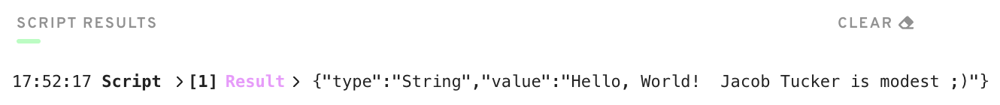

# Chapter-2 : Day-1

*Response to the questions posted here: https://github.com/emerald-dao/beginner-cadence-course/tree/main/chapter2.0/day1#quests*

## Question 1

> Deploy a contract to account 0x03 called "JacobTucker". Inside that contract, declare a constant variable named is, and make it have type String. Initialize it to "the best" when your contract gets deployed.

Contract code

```cadence
pub contract JacobTucker {

    pub let is: String

    init() {
        self.is = "modest ;)"
    }

}
```

## Question 2

> Check that your variable is actually equals "the best" by executing a script to read that variable. Include a screenshot of the output.

Script code

```cadence
import HelloWorld from 0x01
import JacobTucker from 0x03

pub fun main(): String {
    var message = HelloWorld.greeting
    message = message.concat("  Jacob Tucker is ")
    message = message.concat(JacobTucker.is)
    return message
}
```

Script result


