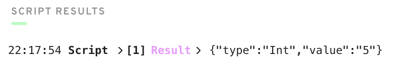

# Chapter-2 : Day-2

*Response to the questions posted here: https://github.com/emerald-dao/beginner-cadence-course/tree/main/chapter2.0/day2#quests*

## Question 1

> Explain why we wouldn't call `changeGreeting` in a script.

Scripts cannot modify data, they are read-only.  Transactions can modify data.

## Question 2

> What does the `AuthAccount` mean in the prepare phase of the transaction?

`AuthAccount` signs a transaction on behalf of the submitting wallet, authorizing access to the account's storage, public keys and code.

## Question 3

> What is the difference between the `prepare` phase and the `execute` phase in the transaction?

`prepare` has access to the account's authorized data while `execute` does not.

All code could be run within `prepare`, but `execute` offers a clean separation of concern.  It also adds to readability, as readers can check what authorized data is accessed by a transaction just by reading the `prepare` phase.

## Question 4

Contract

```
pub contract HelloWorld {

    pub var greeting: String
    pub var myNumber: Int

    init() {
        self.greeting = "Hello, World!"
        self.myNumber = 0
    }

    pub fun changeGreeting(greeting: String) {
        self.greeting = greeting
    }

    pub fun updateMyNumber(number: Int) {
        self.myNumber = number
    }
}
```

Transaction

```
import HelloWorld from 0x01

transaction(myNewNumber: Int) {

  prepare(signer: AuthAccount) {}

  execute {
    HelloWorld.updateMyNumber(number: myNewNumber)
  }
}
```

Script

```
import HelloWorld from 0x01

pub fun main(): Int {
    return HelloWorld.myNumber
}
```

Script result (after running with `myNewNumber = 5`)


