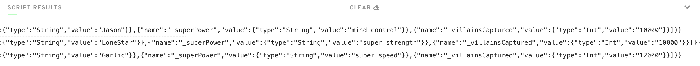

# Chapter-2 : Day-4

*Response to the questions posted here: https://github.com/emerald-dao/beginner-cadence-course/tree/main/chapter2.0/day4#quests*

Contract

```
pub contract Guardians {

    // declare Guardian struct
    pub struct Guardian {
        pub let _name: String
        pub let _superPower: String
        pub let _villainsCaptured: Int

        init(_name: String, _superPower: String, _villainsCaptured: Int) {
            self._name = _name
            self._superPower = _superPower
            self._villainsCaptured = _villainsCaptured
        }
    }

    // cache a dictionary of guardians
    pub var guardians: { Int: Guardian }

    init() {
        self.guardians = {}
    }

    // public function to create a new guardian and add to ca
    pub fun addGuardian(name: String, superPower: String, villainsCaptured: Int) {
        let guardian = Guardian(
            _name: name,
            _superPower: superPower,
            _villainsCaptured: villainsCaptured
        )
        self.guardians.insert(key: self.guardians.length + 1, guardian)
    }

}
```

Transaction

```
import Guardians from 0x01

transaction(name: String, superPower: String, villainsCaptured: Int) {

    prepare(signer: AuthAccount) {}

    execute {
        Guardians.addGuardian(
            name: name,
            superPower: superPower,
            villainsCaptured: villainsCaptured
        )
    }
}
```

Script

```
import Guardians from 0x01

pub fun main(index: Int): Guardians.Guardian {
    return Guardians.guardians[index]!
}
```

Script result


